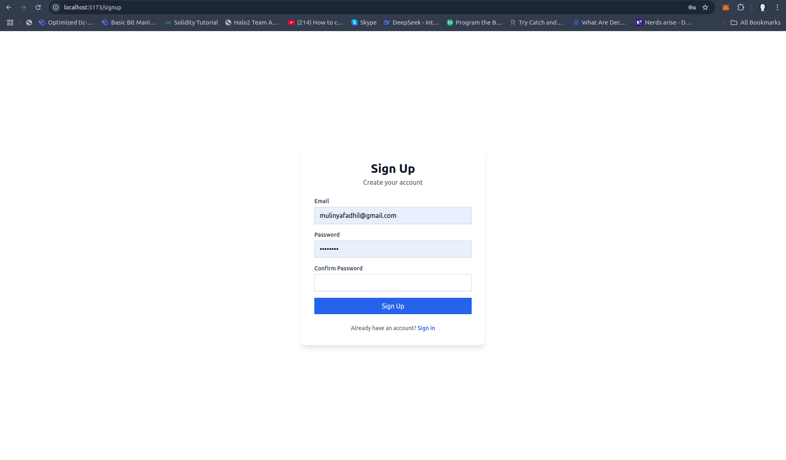
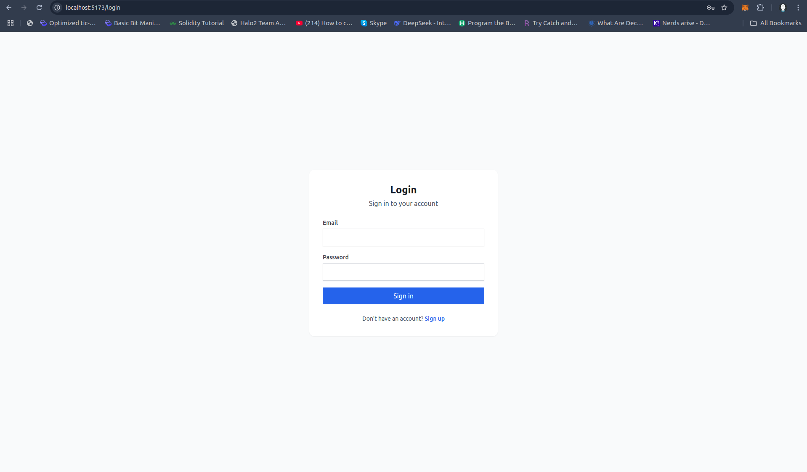

# User Authentication API Documentation

### Running the Application

1. Clone the repository:
   ```
   git clone git@github.com:FadhilMulinya/User-Auth.git
   cd  User-Auth
   ```
or download this zip file
```
cd into User-Auth

```
2. To run 
```
npm i
npm run dev

```
# Frontend test

Enter browser localhost:3000
 and signup or login 



# Backend test
cd into UBackend

```
2. To run 
```
npm i
npm run dev

## 1. Register a New User

**Endpoint:** `POST /api/users/register`

### Request Body:
- `email`: The user's email.
- `password`: The user's password.

### Curl Command:
```bash
curl -X POST http://localhost:8080/api/users/register \
-H "Content-Type: application/json" \
-d '{
  "email": "test@example.com",
  "password": "password123"
}'
```

### Expected Response:
```json
{
  "user": {
    "_id": "64f1a2b3c7e6b4f3a4b5c6d7",
    "email": "test@example.com",
    "createdAt": "2023-09-01T12:00:00.000Z",
    "updatedAt": "2023-09-01T12:00:00.000Z",
    "__v": 0
  },
  "token": "eyJhbGciOiJIUzI1NiIsInR5cCI6IkpXVCJ9..."
}
```

---

## 2. Login with Registered User

**Endpoint:** `POST /api/users/login`

### Request Body:
- `email`: The user's email.
- `password`: The user's password.

### Curl Command:
```bash
curl -X POST http://localhost:8080/api/users/login \
-H "Content-Type: application/json" \
-d '{
  "email": "test@example.com",
  "password": "password123"
}'
```

### Expected Response:
```json
{
  "user": {
    "_id": "64f1a2b3c7e6b4f3a4b5c6d7",
    "email": "test@example.com",
    "createdAt": "2023-09-01T12:00:00.000Z",
    "updatedAt": "2023-09-01T12:00:00.000Z",
    "__v": 0
  },
  "token": "eyJhbGciOiJIUzI1NiIsInR5cCI6IkpXVCJ9..."
}
```
Save the token from the response for use in the next step.

---

## 3. Delete the User (Protected Route)

**Endpoint:** `DELETE /api/users/delete`

### Authentication:
- The token from the login response must be included in the `Authorization` header.

### Curl Command:
Replace `YOUR_JWT_TOKEN` with the token received from the login response.
```bash
curl -X DELETE http://localhost:8080/api/users/delete \
-H "Authorization: Bearer YOUR_JWT_TOKEN"
```

### Expected Response:
```json
{
  "message": "User deleted successfully"
}
```

---

## 4. Testing the Protected Route Without a Token

If you try to access the `/delete` endpoint without a valid token, you should receive a `401 Unauthorized` error.

### Curl Command:
```bash
curl -X DELETE http://localhost:8080/api/users/delete
```

### Expected Response:
```json
{
  "error": "Unauthorized"
}
```

---

## 5. Testing with Invalid Credentials

### Invalid Login Credentials

#### Curl Command:
```bash
curl -X POST http://localhost:8080/api/users/login \
-H "Content-Type: application/json" \
-d '{
  "email": "test@example.com",
  "password": "wrongpassword"
}'
```

#### Expected Response:
```json
{
  "error": "Invalid login credentials"
}
```

### Invalid Registration (Email Already Exists)

#### Curl Command:
```bash
curl -X POST http://localhost:8080/api/users/register \
-H "Content-Type: application/json" \
-d '{
  "email": "test@example.com",
  "password": "password123"
}'
```

#### Expected Response:
```json
{
  "error": "Email already registered"
}
```

